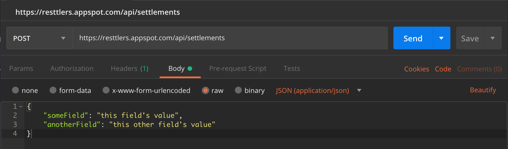

How to Play
===

The Resttlers is a shameless rip-off of [_The Settlers_](https://en.wikipedia.org/wiki/The_Settlers) to demonstrate how REST APIs are used.

Here we will go through the first level of the game together as a tutorial.

What You Need
---

* [Postman](https://www.getpostman.com/)
* A modern browser, i.e. not IE
* Basic understanding of REST APIs

How to follow this tutorial
---

Throughout this tutorial, you will see REST invocations are presented in the following format:

```
<HTTP Verb> <HTTP URL>
<Header1>: <HeaderValue1>
<Header2>: <HeaderValue2>

<Request Payload>
```

That correspond to following sections of Postman:


Here is an example:

```
POST https://resttlers.appspot.com/api/settlements
Content-Type: application/json

{
	"someField": "this field's value",
	"anotherField": "this other field's value"
}
```

Translates to the following in Postman:




## Make the passage

You are a tribe of settlers, looking for a new home. You have set out from to cross perilous plains to reach a suitable plot fo land to start your very first settlement.

While making the passage, you run into some trouble. Go to <https://resttlers.appspot.com/passage> to find out more.

## Build a settlement

Now that you have overcame the harsh passage across the barren lands, you have finally reached an oasis. It is time to build your first settlement.

To create a settlement, make the following REST call:

```
POST https://resttlers.appspot.com/api/settlements
Content-Type: application/json

{
  "name": "<name of the settlement>",
  "leader": "<your name>",
  "incantation": "<the incantation from the parchment>"
}
```

Be sure to replace `<name of the settlement>` with your desired name for the tribe and `<your name>` with your own name so you can find the settlement later.

If done correctly, once you press Send, you will see a response similar to below at the bottom of Postman window:

```
{
    "id": "<settlement id>",
    "name": "<name of the settlement>",
    "leader": "<your name>",
    "apiKey": "<you api key>",
    "createdAt": "<timestamp of when the settlement was established>"
}
```

Take a note of `id`. This is the unique identifier to distinguish your settlement from others. You will need this ID to make all future calls.

_Please note all IDs in this game are case-sensitive._

Also write down the value of `apiKey`. This is the _password_ to access your settlement. **This value will never be displayed again so make sure you save it somewhere.**

Explore your settlement
---

You can _view_ your settlement using the following REST call

```
GET https://resttlers.appspot.com/api/settlements/<id>
```

Replace `<id>` with the `id` value that was returned in the "Build a settlement" response. 

The response should look familiar:

```
{
    "id": "<id>",
    "name": "<settlement name>",
    "leader": "<your name>",
    "objective": "Build a Quarry, a Woodcutter's hut and a Sawmill"
}
```

We'll come back to the `objective` later on.

Let's now take a look at the _resources_ that are available in your settlement:

```
GET https://resttlers.appspot.com/api/settlements/<id>/resources
```

Here is what a typical response looks like:

```
{
    "tree": 200,
    "stoneDeposit": 500,
    "lumber": 0,
    "plank": 10,
    "stone": 10
}
```

Your settlement looks rich in basic resources. These can be used to produce more useful resources.

To produce better resources, you need _Buildings_. Your tribe has builders who know how to construct certain building types. 

Let's see what building types your builders can currently produce:

```
GET https://resttlers.appspot.com/api/settlements/<id>/buildingTypes
```

The response would look something like this:

```
{
    "size": 4,
    "items": [
        {
            "id": "quarry",
            "cost": {
                "plank": 2
            },
            "consumes": [
                "stoneDeposit"
            ],
            "produces": [
                "stone"
            ]
        },
        {
            "id": "forester",
            "cost": {
                "plank": 2
            },
            "consumes": [],
            "produces": [
                "tree"
            ]
        },
        {
            "id": "woodcutter",
            "cost": {
                "plank": 2
            },
            "consumes": [
                "tree"
            ],
            "produces": [
                "lumber"
            ]
        },
        {
            "id": "sawmill",
            "cost": {
                "stone": 2,
                "plank": 2
            },
            "consumes": [
                "lumber"
            ],
            "produces": [
                "plank"
            ]
        }
    ]
}
```

The `id` field is the building type. It looks like you can construct buildings of types `quarry`, `woodcutter`, `sawmill` and `forester`.

The builders need some resources to construct each building. This is indicated in the `cost` field. You need make sure you have enough resources before you decide to construct a building.

Once a building is constructed, it consumes certain resources and produces others. For example, `quarry` spends `stoneDeposit`s and produces `stone`s.

`plank` is an essential resource to your settlement. `sawmill` building produces `plank`. However, it consumes `lumber` to do so and you need a `woodcutter` building to convert `tree` to `lumber`.

It looks like you need a supply chain to start producing `timber`:

```
tree --woodcutter--> lumber --sawmill--> plank 
```

It looks like we need to construct some buildings!

Construct a building
---

Let's go back to the `objective` that we saw when viewing our settlement:

```
GET https://resttlers.appspot.com/api/settlements/<id>
```

> Build a Quarry, a Woodcutter's hut and a Sawmill

Let's start by building the Quarry:

```
POST https://resttlers.appspot.com/api/settlements/<id>/buildings
Content-Type: application/json
API-Key: <your API key>

{
  "type": "quarry"
}
```

Use the `apiKey` value returned in your "Build a settlement" response for `<your API key>`.

You should get a response like this:

```
{
    "id": "<building id>",
    "type": "quarry",
    "status": "buildQueued"
}
```

You received a HTTP 202 response from the server. This means that the server has accepted your request but it has not created the entity right away. Your builders will need some time to construct the building hence `buildQueued`.

You can view all your buildings in your settlement with this request:

```
GET https://resttlers.appspot.com/api/settlements/<id>/buildings
```

Or view a single building directly:

```
GET https://resttlers.appspot.com/api/settlements/<id>/buildings/<building id>
```

Where `<building id>` is the `id` from the "construct a building" response.

Once your building is constructed, it will start consuming the resources that was in its building type `consumes` field, in this case: `stoneDeposit`s.

If you check your resources, you will see that `stoneDeposit`s are being slowly consumed and converted to `stone`s.

```
GET https://resttlers.appspot.com/api/settlements/<id>/resources
```

We have built our first building!

Meet the objective
---

Let's finish the objective by constructing the rest of the buildings.

First the woodcutter:

```
POST https://resttlers.appspot.com/api/settlements/<id>/buildings
Content-Type: application/json
API-Key: <your API key>

{
  "type": "woodcutter"
}
```

Then the sawmill

```
POST https://resttlers.appspot.com/api/settlements/<id>/buildings
Content-Type: application/json
API-Key: <your API key>

{
  "type": "sawmill"
}
```

The building construction gets queued so they will become available in the order they were requested.

Once the builders construct all the requested buildings, you can check your settlement again to see a new objective.

```
GET https://resttlers.appspot.com/api/settlements/<id>
```

This means you have levelled up! This also means new buildings and resources are available to your settlement.

```
GET https://resttlers.appspot.com/api/settlements/<id>/buildingTypes
```

```
GET https://resttlers.appspot.com/api/settlements/<id>/resources
```

**Oh by the way, if you are getting bored `GET`ing the status of your settlement, there is always <https://resttlers.appspot.com/>.**

Play on
---

The rest is up to you! Meet more objectives, build up your settlement and prosper.

Be sure to keep an eye on your resources so your supply chains don't halt.

_**Tip:** You probably want to also build a `forester` to ensure you don't run out of trees._